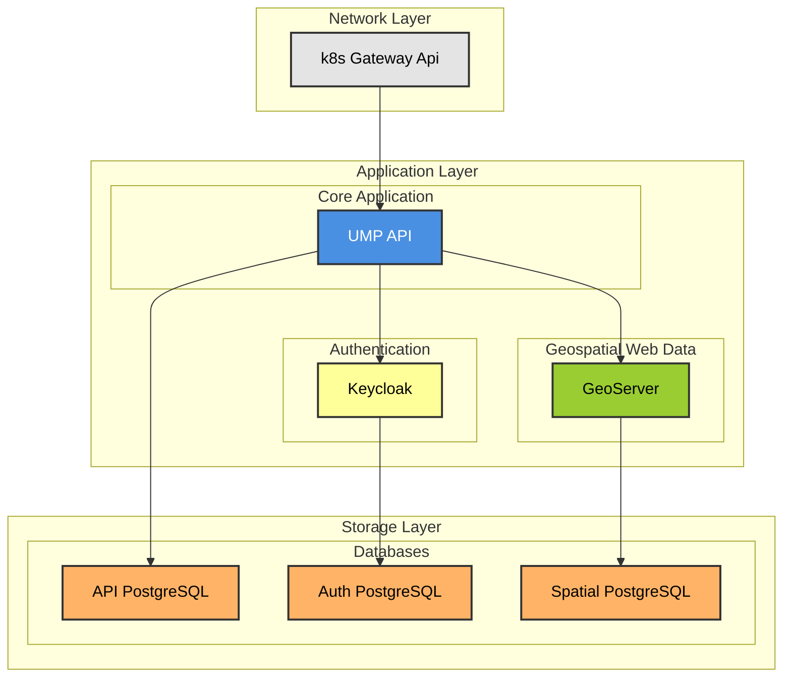

# Urban Model Platform
The Urban Model Platform is an Open Urban Platform to distribute and access (simulation) models for Urban Digital Twins. It builds on the [OGC API Processes](https://docs.ogc.org/is/18-062r2/18-062r2.html) open standard and was developed by the City Science Lab at HafenCity University Hamburg and the Agency for Geoinformation and Suveying in the context of the [Connected Urban Twins](https://www.connectedurbantwins.de/) project.

The repository contains a Python implementation of the OGC API Processes standard that can be used as a "system of systems" open platform. In the context of digital urban twins, such a platform can provide the infrastructure to integrate and combine domain-specific models ranging from simple regression models to advanced simulation and AI models. Instead of executing jobs and processes on the server itself, the Urban Model Platform is configured with multiple providers or model servers.

This architecture is independent of any frontend application. One could use e.g. the [Scenario Explorer](https://github.com/citysciencelab/scenario-explorer-addon) as a client frontend, but due to the standardized API, mutliple frontends are possible.

## Documentation

➡️📑 Check out the full **documentation** [here](https://citysciencelab.github.io/urban-model-platform/)

➡️🧑‍💻 Check out how to [Contribute](CONTRIBUTING.md)

➡️🗓️ Find the latest [Changes](CHANGELOG.md)

## Application architecture and dependency diagram

_________

The Urban Model Platform was developed in the context of the "Connected Urban Twins" Project and was funded by the KfW and the Federal Ministry for Housing and Urban Development 

