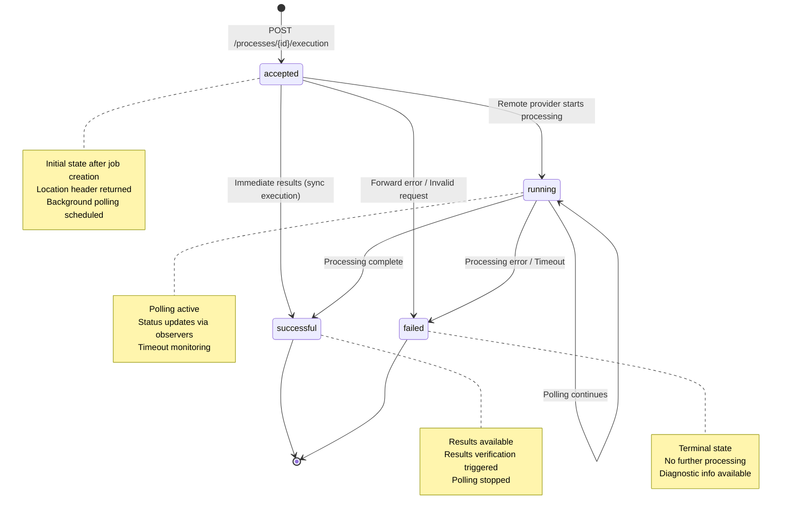
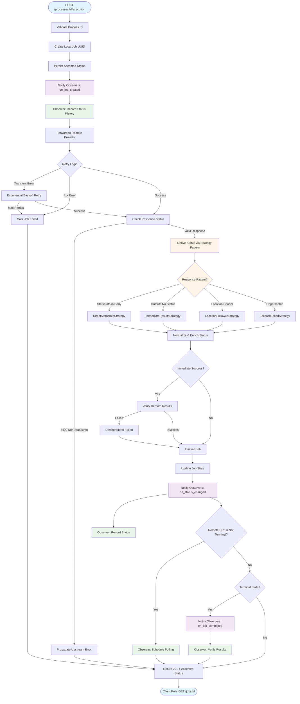
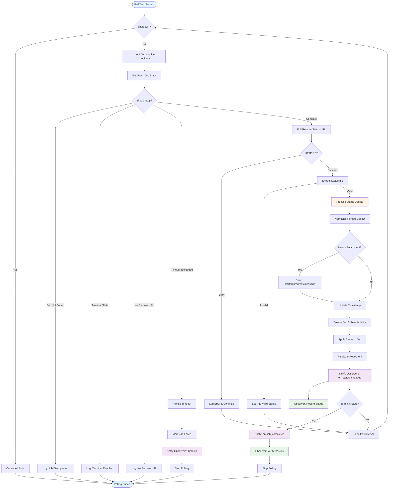
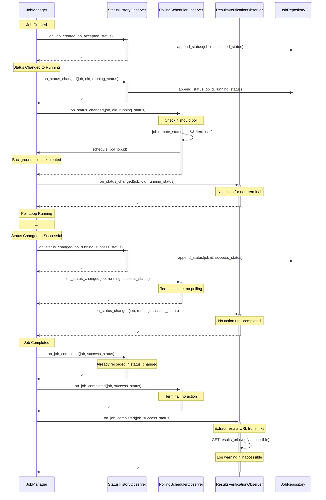
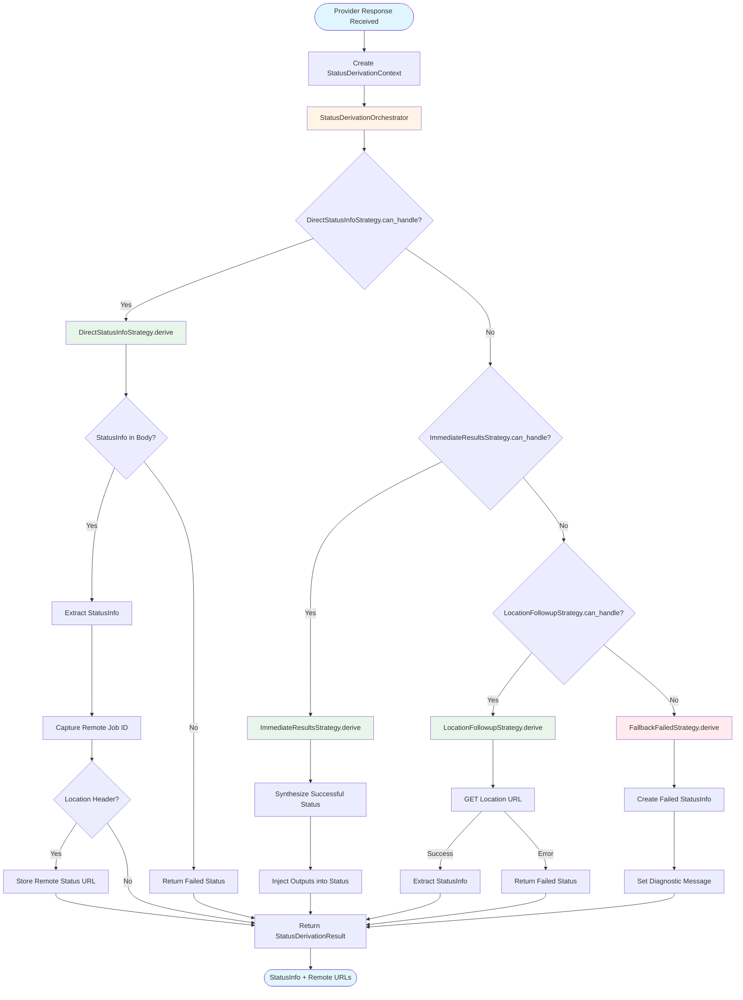
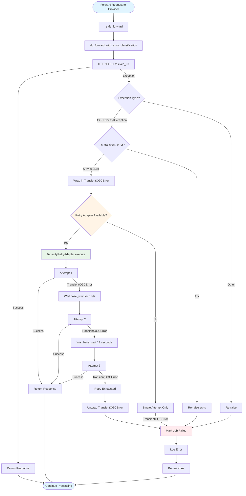
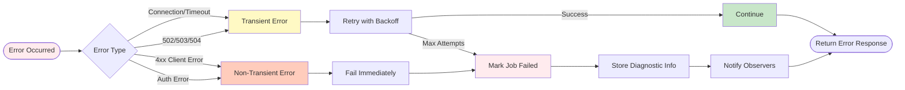

# Job Lifecycle and State Transitions

This document provides visual models of the job handling flow in the Urban Model Platform.

## Job State Machine

## Job Creation and Forwarding Flow

## Polling Loop Flow

## Observer Pattern Interactions

## Strategy Pattern: Status Derivation

## Retry Logic Flow

## Key Design Patterns Summary

| Pattern | Location | Purpose |
|---------|----------|---------|
| **Strategy** | Status Derivation | Handle different provider response formats |
| **Observer** | State Transitions | Decouple side effects from core logic |
| **Adapter** | Retry Logic | Abstract retry implementation (Tenacity) |
| **Port/Adapter** | All External Deps | Hexagonal architecture boundaries |
| **Guard Clause** | Polling Loop | Reduce nesting, early returns |
| **Command Query Separation** | Helper Methods | Queries return values, commands perform actions |

## State Transition Rules

### From `accepted`
- ✅ → `running` (remote provider starts processing)
- ✅ → `successful` (immediate sync results)
- ✅ → `failed` (forward error, invalid request)

### From `running`
- ✅ → `running` (polling continues, no change)
- ✅ → `successful` (processing complete)
- ✅ → `failed` (processing error, timeout)

### From `successful`
- ❌ Terminal state, no transitions

### From `failed`
- ❌ Terminal state, no transitions

## Error Handling Strategy

## Configuration Impact

| Setting | Default | Impact |
|---------|---------|--------|
| `poll_interval` | 5.0s | Frequency of status checks |
| `poll_timeout` | None | Max time before timeout failure |
| `forward_max_retries` | 3 | Retry attempts for transient errors |
| `forward_retry_base_wait` | 1.0s | Initial wait between retries |
| `forward_retry_max_wait` | 5.0s | Maximum wait between retries |
| `rewrite_remote_links` | True | Replace remote URLs with local |
| `inline_inputs_size_limit` | 64KB | Max size for inline input storage |
