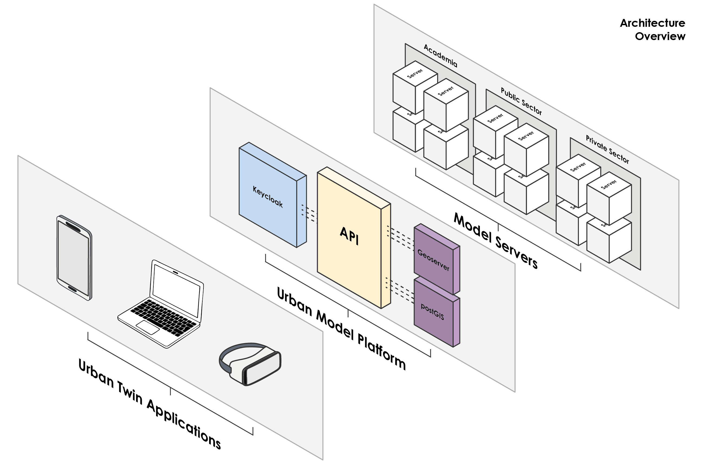

(architecture-overview)=
# Overview

The Urban Model Platform is essentially a server federation API that connects multiple model servers and provides a single access point to them. It is a middleware between the model servers and the clients.

Its main components are:

- **Flask API**: The main entry point of the Urban Model Platform. It handles incoming requests and routes them to the appropriate model server using the OGC API Processes standard. [Learn more](API)
- **Keycloak**: With Keycloak, the Urban Model Platform provides authentication and authorization for users. It allows users to log in and access the platform securely and platform administrators to manage user roles and permissions.[Learn more](Keycloak)
- **GeoServer**: The Urban Model Platform can be configured to store results in a GeoServer instance. This allows users to visualize the results of their simulations on a map with the respective WFS and WMS layers.[Learn more](GeoServer)

Additionally you need a **PostgreSQL** database to store jobs for the UMP and geoserver layers (provided you configured "geoserver" as result storage) 

To learn how to properly configure providers, check out the [User Guide](providers) section.
